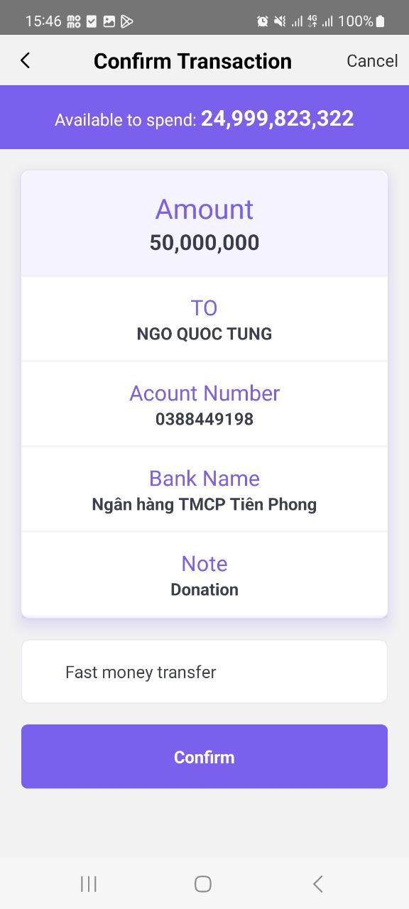

  
  
  

  
  
  

  
  
  

## Features
- "@react-navigation/bottom-tabs": "^6.5.11"
- "@react-navigation/native": "^6.1.9"
- "@react-navigation/native-stack": "^6.9.17"
  
- "react": "18.2.0"
- "react-native": "0.72.7"
  
- "react-redux": "^9.1.0"
- "redux-logger": "^3.0.6"
- "redux-persist": "^6.0.0"
- "@reduxjs/toolkit": "^2.0.1"

## Link Server:
- [Server Documents VietQR](https://my.vietqr.io/lookup/account-number)
- [Server Decode QR](https://decode-vietqr.vercel.app/decode-vietqr)

